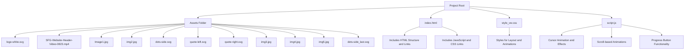

### 1. **Badges**
   - **Badges** can highlight key information about your project, such as the license type, build status, or technology stack. They are often placed at the top of the README.

   # Golf Club Website


### 2. **Table of Contents**
   
## Table of Contents

| Section                    | Description                                                                 |
|----------------------------|-----------------------------------------------------------------------------|
|Overview   | The project is a website for Sidcup Family Golf, featuring interactive and animated elements to enhance user experience. It includes a coffee shop, golf lessons, and more. |
| Key Features | Interactive navigation, dynamic animations using GSAP, custom cursor effects, and a progress button for easy scrolling. |
| Project Structure | The project is organized into HTML and JavaScript files, with styles and assets in their respective folders. The `index.html` file handles the structure, while `script.js` manages dynamic functionality. |
| Efficient Use of JavaScript | JavaScript is used for dynamic effects such as custom cursors, animations with GSAP, and handling scroll-based progress indicators. |
| Installation and Setup| To set up the project, clone the repository, install dependencies via npm (for any JavaScript packages), and open `index.html` in a browser. No further installation is required for basic setup. |
| Future Enhancements| Planned enhancements include adding more interactive elements, improving accessibility features, and expanding the site's content like adding `golf lessons page `. |
| Contributing| Contributions are welcome. Please submit a pull request or open an issue for any improvements or bug fixes. Follow the coding standards and include relevant tests. |
| License     | The project is licensed under the MIT License. See the `LICENSE` file for details. |
| Contact       | For any inquiries or feedback, please contact at khushal.sav@gmail.com. |


### 3. **Screenshots and GIFs**
  
   ## Preview


   

### 4. **Mermaid Diagrams**
   - Use **Mermaid** syntax to include flowcharts, Gantt charts, or sequence diagrams directly in your README for visualizing the project structure or processes.
# Project Structure

## Overview
This diagram illustrates the structure and key components of the golf club site.



---

### 5. **Custom Icons**
   - **Enhance Visual Appeal:** Incorporate icons from **FontAwesome** or **Simple Icons** to make headings and lists stand out and be more engaging. This adds a visual touch that can help convey the meaning of sections or features quickly.
   
   markdown
   ## Features
   - 🏌️‍♂️ **Responsive Design**: The website adapts seamlessly to various screen sizes, ensuring a consistent user experience across devices.
   - ✨ **Interactive Animations**: Utilizes GSAP for smooth, engaging animations that enhance the overall user experience.
   - 🛠️ **Modular JavaScript Architecture**: Code is organized into reusable modules for better maintainability and scalability.
   
### 6. **Code Blocks with Syntax Highlighting**
   - **Readable Code Examples:** Use GitHub Flavored Markdown to include code snippets with syntax highlighting. This makes your code samples easier to read and understand, which is especially useful for demonstrating functionality or providing implementation details.
   
   ```javascript
// Initialize GSAP animations
function initAnimations() {
    // Animate the header to slide in from above
    gsap.from(".header", {
        duration: 1,   // Duration of the animation
        y: -50,        // Initial vertical position
        opacity: 0,    // Start with full transparency
        ease: "power2.out"  // Easing function for smoothness
    });
    
    // Create a scroll-triggered animation for sections
    gsap.from(".section", {
        scrollTrigger: {
            trigger: ".section",  // Element that triggers the animation
            start: "top 80%",     // Start animation when the top of the section is 80% from the top
            end: "top 50%",       // End animation when the top of the section is 50% from the top
            scrub: true           // Smoothly animate based on scroll position
        },
        duration: 1.5,       // Duration of the animation
        y: 100,              // Initial vertical offset
        opacity: 0,          // Start with full transparency
        ease: "power3.inOut" // Easing function for smoothness
    });
}

// Function to update the progress bar based on scroll position
function updateScrollProgress() {
    const progressBar = document.getElementById("progress");
    const scrollTop = document.documentElement.scrollTop;
    const docHeight = document.documentElement.scrollHeight;
    const winHeight = window.innerHeight;
    const scrollPercent = (scrollTop / (docHeight - winHeight)) * 100;

    // Update progress bar width
    progressBar.style.width = `${scrollPercent}%`;
}

// Attach scroll event listener to update progress bar
window.addEventListener('scroll', updateScrollProgress);

// Initialize animations when the page loads
window.addEventListener('load', initAnimations);

   ```
### Explanation:
1. **`initAnimations()` Function:**
   - **Header Animation:** Uses GSAP to animate the header sliding in from above and fading in.
   - **Section Animation:** Animates elements with the class `.section` based on scroll position using GSAP’s `ScrollTrigger`.

2. **`updateScrollProgress()` Function:**
   - Calculates the scroll percentage and updates the width of the progress bar accordingly.

3. **Event Listeners:**
   - **Scroll Event:** Calls `updateScrollProgress` to keep the progress bar in sync with the scroll position.
   - **Load Event:** Calls `initAnimations` to initialize animations when the page loads.


### 7. **Custom Headers with Emoji**
- **Engage and Inform:** Adding emojis to your headers can make your README more engaging and visually appealing. It provides a quick visual reference and adds personality to the document.

## 🚀 Key Features
- **Interactive Navigation**: Dynamic menu with smooth transitions.
- **Custom Cursor Effects**: Enhances user interaction with a personalized cursor.
- **Progress Button**: Easy scroll-to-top functionality for better navigation.


### 8. **Links and References**
   - Make use of inline links to reference related repositories, documentation, or tools used in your project.

  
   For more information, visit the [GSAP Documentation](https://greensock.com/docs/).
   

### 9. **Contribution Guidelines**
   
   Contributions are welcome! Please fork the repository and create a pull request.

### 10. **Embedded YouTube Video**

   ## 🎥 Demo Video
```
  https://www.youtube.com/watch?v=NV30LJdvy3c)
  https://www.youtube.com/watch?v=4QN9VNHILHo)
   ```
